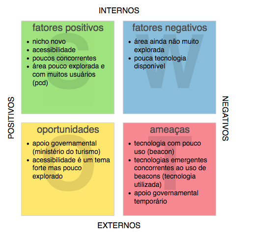
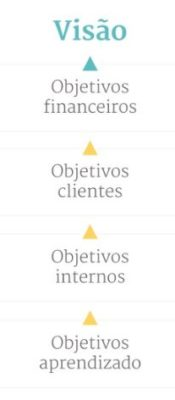
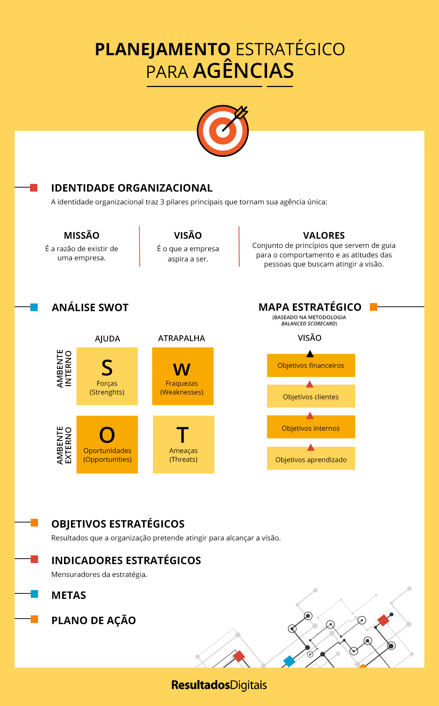

= TATU: plano estratégico
Autores <{wvb, dcsales, glnjunior}@ic.ufal.br>
v1.0, 2019-03-16

== _Stakeholders_

_Quando falamos sobre como fazer um planejamento estratégico, um dos primeiros pontos é identificar quais são os grupos de pessoas ou entidades que afetam ou são afetadas pelas atividades da sua agência: os stakeholders._

== Identidade organizacional

=== Missão

_É a razão de existir de uma empresa._

=== Visão

_É o que a empresa aspira a ser._

=== Valores

_Conjunto de princípios que servem de guia para o comportamento e as atitudes das pessoas que buscam atingir a visão._

== Análise SWOT

_Mais uma etapa importante de estar presente no planejamento estratégico da sua agência é fazer uma análise SWOT.
Esse termo vem do inglês e a sigla se refere a forças (strengths), fraqueza (weakness), oportunidades (opportunities) e ameaças (threats)._

.Matriz SWOT
[.float='center', align='center']

== Mapa estratégico

_Para a construção do mapa estratégico sugerimos a metodologia do Balanced Scorecard, que é baseada em quatro pilares principais:_

* _Perspectiva financeira_
* _Perspectiva de mercado_
* _Processos internos_
* _Recursos_

_A partir da metodologia do Balanced Scorecard podem ser traçados:_

.Objetivos
[.float='center', align='center']

=== Objetivos estratégicos

_Resultados que a organização pretende atingir para alcançar a visão._

=== Indicadores estratégicos

_Mensuradores da estratégia._

=== Metas (_SMART Model_)

* S - Específico
* M - Mensurável
* A - Atingível
* R - Relevante
* T - Temporizável

== Plano de ação

_Definidos os objetivos e metas, o próximo passo é sair do plano das ideias e botar a mão na massa.
Para isso, é importante montar um plano de ações, ou seja, o que será feito na prática para alcançar o que busca – “como” você irá fazer para atingir os objetivos e metas._

== Infográfico

.Infográfico

---

link:https://resultadosdigitais.com.br/agencias/planejamento-estrategico/[Fonte.]
